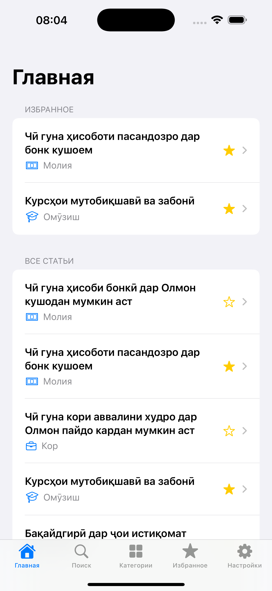
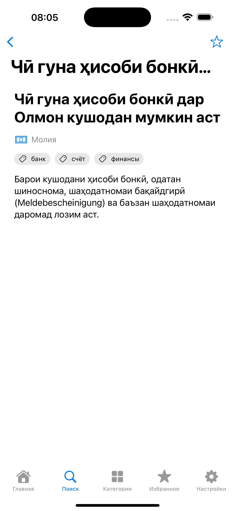
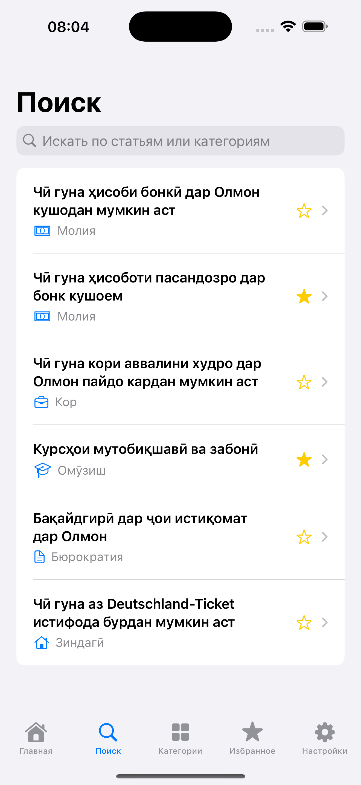
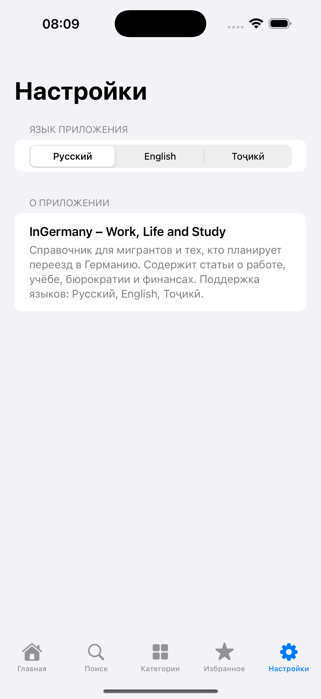
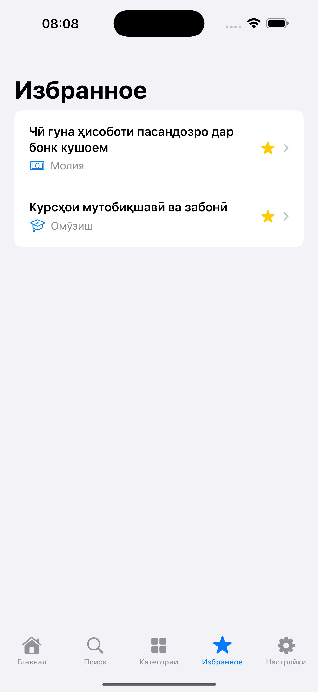

# 🇩🇪 InGermany — SwiftUI iOS App

## 👤 Обо мне

**Автор:** Umed Sabzaev  
**Локация:** Германия, Тюрингия  
**Роль:** iOS Developer / Translator / Content Creator  

### 🔧 Навыки и техника
- **Языки программирования:** Swift, SwiftUI, Python, JavaScript  
- **Фреймворки и технологии:** SwiftUI, UIKit (базово), Firebase (в планах), CoreData, Git, GitHub, WordPress  
- **Инструменты разработки и тестирования:**  
  - Xcode (iOS разработка, симуляторы)  
  - VS Code (веб и Python)  
  - Git + GitHub (контроль версий, совместная работа)  
  - Figma (UI/UX дизайн)  
  - Notion / Trello (планирование задач)  
  - Local by Flywheel (WordPress, сайт)  
  - Тестирование: Xcode Previews, симулятор iOS, отладка на **iPhone 16 Pro Max** и **Tecno Pova 4**  

---

## 📱 О проекте: *InGermany – Work, Life and Study*

**Миссия:** помочь мигрантам, студентам и семьям, планирующим переезд в Германию, разобраться в бюрократии, финансах, учёбе и повседневной жизни.  

Приложение выступает как **справочник и навигатор**, объединяя статьи, калькуляторы и практические советы.  

---

### ⚡️ Текущий статус (сентябрь 2025)
- Создан проект **InGermany** в **Xcode (Swift + SwiftUI, iOS 17+)**.  
- Настроена структура папок (см. ниже).  
- Подключены **JSON‑данные** (статьи и категории).  
- Реализованы экраны: `Home`, `Categories`, `ArticlesByCategory`, `Search`, `ArticleView`.  
- Поддержка **мультиязычности**: RU / EN / TJ.  
- Реализовано:  
  - Список всех статей  
  - Категории с иконками  
  - Фильтрация статей по категориям  
  - Поиск по заголовкам, содержимому и тегам (с подсветкой)  
  - Полный просмотр статьи с тегами и навигацией по ним  

---

### 📂 Структура проекта

```
InGermany/
├── Core/                
│   ├── InGermanyApp.swift        # Точка входа в приложение
│   └── ContentView.swift         # Корневой контейнер вкладок
│
├── Models/              
│   ├── Article.swift              # Модель статьи (id, LocalizedText, category, tags)
│   └── Category.swift             # Модель категории (id, CategoryName, icon)
│
├── Views/               
│   ├── HomeView.swift             # Список всех статей
│   ├── CategoriesView.swift       # Список категорий
│   ├── ArticlesByCategoryView.swift # Статьи по выбранной категории
│   ├── ArticleView.swift          # Полный текст статьи + теги
│   ├── SearchView.swift           # Поиск по статьям и тегам
│   ├── SettingsView.swift         # Экран настроек (язык, тема, аккаунт)
│   ├── FavoritesView.swift        # (план) избранные статьи
│   └── Components/
│       └── ArticleRow.swift       # UI‑компонент для отображения статьи
│
├── Services/
│   ├── DataService.swift          # Загрузка данных из JSON
│   └── AuthService.swift          # (план) логика аутентификации
│
├── Utils/
│   ├── CategoryManager.swift      # Работа с категориями
│   ├── LocalizationManager.swift  # Мультиязычность
│   └── Theme.swift                # Светлая/тёмная тема (в разработке)
│
├── Resources/
│   ├── articles.json              # База статей (RU/EN/TJ)
│   └── categories.json            # Список категорий и иконок
│
├── Assets.xcassets/               # Иконки и цвета
├── Screenshots/                   # Скриншоты для README
├── .gitignore                     
└── README.md                      
```

---

### 📸 Скриншоты

<p align="center">
  
  
  
</p>

<p align="center">
  
  
  
</p>

---

### 🗺 Roadmap

- [x] Базовая структура проекта (SwiftUI + JSON)  
- [x] Поддержка 3 языков (RU, EN, TJ)  
- [x] Экран категорий и фильтрация статей  
- [x] Поиск по заголовкам, текстам и тегам  
- [ ] ⭐ Избранные статьи (сохранение через `FavoritesManager`)  
- [ ] 📤 Поделиться статьёй (`ShareLink`)  
- [ ] 🎨 Светлая / Тёмная тема (`Theme.swift`)  
- [ ] 👤 Вход через Email / Google / Apple ID  
- [ ] ☁️ Синхронизация статей через Firebase / свой backend  
- [ ] 📶 Оффлайн‑режим (CoreData)  
- [ ] 📊 Финансовые калькуляторы (депозиты, расходы)  
- [ ] 🎥 Интеграция с YouTube‑каналом *How it works in Germany*  

---

## 🔗 GitHub и работа с репозиторием

### Первичная настройка
```bash
cd /Users/sumtjk/Desktop/InGermany
git init
git add .
git commit -m "Initial commit"
git branch -M main
git remote add origin https://github.com/UmedTJK/InGermany.git
git push -u origin main
```

> ⚠️ GitHub больше не принимает обычные пароли. Используй **Personal Access Token (PAT)** вместо пароля.

### Как получить PAT
1. Перейди в [GitHub → Settings → Developer settings → Personal access tokens → Tokens (classic)](https://github.com/settings/tokens).  
2. Нажми **Generate new token → Classic**.  
3. Выбери срок действия (например, 90 дней).  
4. Отметь scope: `repo`.  
5. Скопируй токен и используй его вместо пароля при `git push`.  

### Основные команды
```bash
# Добавить изменения
git add .

# Создать коммит
git commit -m "Описание изменений"

# Отправить на GitHub
git push
```

### Работа с ветками
```bash
# Создать новую ветку
git checkout -b feature/new-feature

# Отправить её в GitHub
git push -u origin feature/new-feature
```

---

## 🤝 Contributing

Если хочешь, чтобы другие разработчики или AI‑ассистенты помогали с проектом:  

1. Сделай **fork** репозитория.  
2. Создай новую ветку: `git checkout -b feature/my-feature`.  
3. Внеси изменения и сделай коммит.  
4. Отправь изменения: `git push origin feature/my-feature`.  
5. Создай **Pull Request** в основной репозиторий.  

---

## 📊 Для ИИ и автоматизации

- **Модели:** `Article`, `Category`, `LocalizedText` → `Codable`, `Identifiable`  
- **Мультиязычность:** централизована через `LocalizationManager`  
- **Данные:** хранятся в `Resources/` (JSON) и загружаются через `DataService`  
- **Модули:** `Core`, `Models`, `Views`, `Services`, `Utils`, `Resources`  
- **GitHub‑связка настроена** → AI может анализировать код напрямую  
- **CI/CD:** в будущем планируется GitHub Actions для сборки и тестирования  

---

## ⚖️ Лицензия

Проект распространяется под лицензией **MIT**.  
Ты можешь использовать, изменять и распространять код с указанием автора.  

